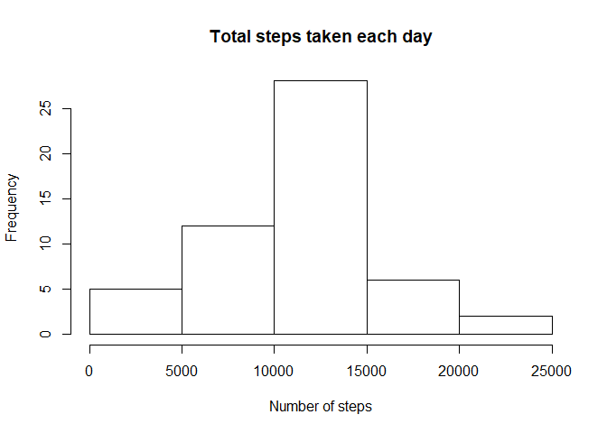
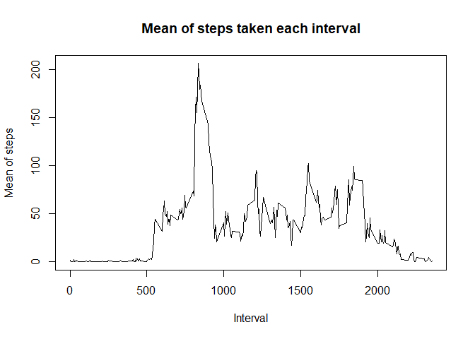
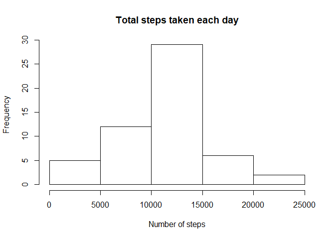
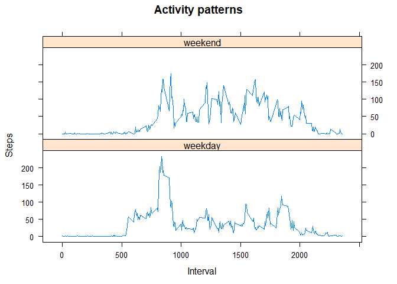

# Reproducible Research assigmnent week 2
Hung Dinh  
March 26, 2018  


### Loading and preprocessing the data
Load the data (using read.csv)  
Transform date format


```r
data <- read.csv("./activity.csv", na.strings = "NA")
data$date <- as.Date(data$date, "%Y-%m-%d")
```

### What is mean total number of steps taken per day?
For this part of the assignment, you can ignore the missing values in the dataset.  
* Make a histogram of the total number of steps taken each day  
* Calculate and report the mean and median total number of steps taken per day


```r
# remove NA
dat1 <- data[complete.cases(data), ]
# calculate total step taken each day
dat1_steps <- aggregate(steps ~ date, data = dat1, sum)
# make histogram
hist(dat1_steps$steps, main="Total steps taken each day", xlab="Number of steps")
```

<!-- -->

```r
# calculate mean, median
info <- summary(dat1_steps$steps)
info
```

```
##    Min. 1st Qu.  Median    Mean 3rd Qu.    Max. 
##      41    8841   10765   10766   13294   21194
```
Mean and median total number of steps taken per day are 10766.19 and 10765, respectively.

### What is the average daily activity pattern?
Make a time series plot (i.e. type = "l") of the 5-minute interval (x-axis) and the average number of steps taken, averaged across all days (y-axis).  
Which 5-minute interval, on average across all the days in the dataset, contains the maximum number of steps?


```r
dat1_steps_int <- aggregate(steps ~ interval, data = dat1, mean)
plot(dat1_steps_int$steps ~ dat1_steps_int$interval, type = "l",
     main="Mean of steps taken each interval", xlab="Interval", ylab="Mean of steps")
```

<!-- -->

```r
int_max <- dat1_steps_int$interval[dat1_steps_int$steps == max(dat1_steps_int$steps)]
int_max
```

```
## [1] 835
```
The 5-minute interval contains max number of steps is 835.

### Imputing missing values
Note that there are a number of days/intervals where there are missing values (coded as NA). The presence of missing days may introduce bias into some calculations or summaries of the data.  
* Calculate and report the total number of missing values in the dataset (i.e. the total number of rows with NAs)  
* Devise a strategy for filling in all of the missing values in the dataset. The strategy does not need to be sophisticated. For example, you could use the mean/median for that day, or the mean for that 5-minute interval, etc.  
* Create a new dataset that is equal to the original dataset but with the missing data filled in.  
* Make a histogram of the total number of steps taken each day and Calculate and report the mean and median total number of steps taken per day. Do these values differ from the estimates from the first part of the assignment? What is the impact of imputing missing data on the estimates of the total daily number of steps?


```r
# total number of missing values in the dataset (i.e. the total number of rows with NAs)
narow <- sum(!complete.cases(data))
```
Total number of rows with NAs is 2304.

The filling strategy I use will be using mean for the 5-minute interval


```r
# find na rows
data_fill <- data
na_row <- which(is.na(data_fill), arr.ind=TRUE)[,1]
# fill in mean of 5-minute interval
data_fill[na_row,1] <- dat1_steps_int[dat1_steps_int$interval == data_fill[na_row,3],2]
# make histogram
data_fill_steps <- aggregate(steps ~ date, data = data_fill, sum)
hist(data_fill_steps$steps, main="Total steps taken each day", xlab="Number of steps")
```

<!-- -->

```r
# quantitatively investigate impact of imputing missing data
summary(data_fill_steps$steps)
```

```
##    Min. 1st Qu.  Median    Mean 3rd Qu.    Max. 
##      41    8860   10766   10766   13191   21194
```
From both the graph and summary results, we can see that the mean and median values do not differ much from the first part of the assignment, to conclude: there is NO IMPACT of imputing missing data on the estimates of the total daily number of steps.

### Are there differences in activity patterns between weekdays and weekends?
For this part the weekdays() function may be of some help here. Use the dataset with the filled-in missing values for this part.  
* Create a new factor variable in the dataset with two levels – “weekday” and “weekend” indicating whether a given date is a weekday or weekend day.  
* Make a panel plot containing a time series plot (i.e. type = "l") of the 5-minute interval (x-axis) and the average number of steps taken, averaged across all weekday days or weekend days (y-axis). See the README file in the GitHub repository to see an example of what this plot should look like using simulated data.


```r
data_fill$DayInWeek <- ifelse(weekdays(data_fill$date) %in% c("Saturday", "Sunday"), "weekend", "weekday")
data_fill_int <- aggregate(steps ~ interval + DayInWeek, data = data_fill, mean)
library(lattice)
xyplot(steps ~ interval | DayInWeek, data = data_fill_int, layout = c(1,2),
       type = "l",  main = "Activity patterns", xlab="Interval", ylab="Steps")
```

<!-- -->


